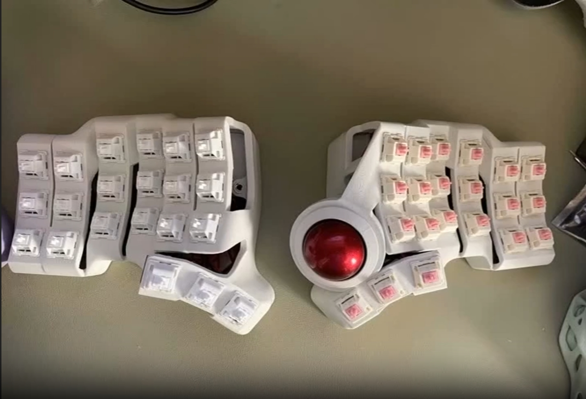

# HatsuMini-tbk_36-urob
Charybdis/Hatsu Mini 3x6 with trackball and urob-style keymap

## Notes:
  * The keyboard was bought at [AliExpress](https://vi.aliexpress.com/item/3256807955896097.html?spm=a2g0o.productlist.main.21.7a63308feKN9j0&algo_pvid=52978fbb-32d5-440d-ba01-d92536ab39be&algo_exp_id=52978fbb-32d5-440d-ba01-d92536ab39be-10&pdp_npi=4%40dis%21VND%21935669%21336839%21%21%21266.39%2195.90%21%40212e520d17331937997352992eb91e%2112000043967467276%21sea%21VN%21734542727%21ABX&curPageLogUid=2H1iVPUHZKzW&utparam-url=scene%3Asearch%7Cquery_from%3A&gatewayAdapt=4itemAdapt)
  * The original ZMK source code of the keyboard was found at this [repo](https://github.com/LXF-YZP/HatsuMini/tree/tbk_36)
